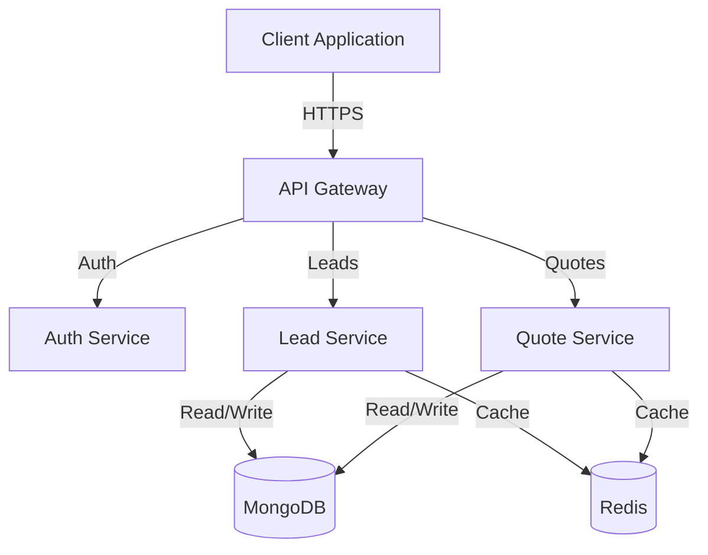
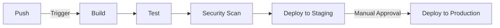

# Multi-tenant CRM System

[](https://github.com/your-org/multi-tenant-crm/actions)
[](https://codecov.io/gh/your-org/multi-tenant-crm)
[](./LICENSE)
[](https://nodejs.org)

Enterprise-grade CRM solution for organizations requiring robust lead management with comprehensive pipeline tracking and multi-tenant capabilities.

## Project Overview

The Multi-tenant Customer Relationship Management (CRM) system is a sophisticated solution designed to provide comprehensive lead management capabilities across diverse organizations. Built on Node.js and React, the system addresses critical business needs through a structured 12-stage pipeline process while maintaining strict data isolation between tenants.

### Key Features

- 🏢 Multi-tenant architecture with complete data isolation
- 📊 12-stage lead management pipeline
- 👥 Comprehensive agent management and assignment
- 💰 Integrated quote generation and tracking
- 📈 Real-time analytics and dashboards
- 🔒 Enterprise-grade security

### System Architecture



## Getting Started

### Prerequisites

- Node.js (>=18.x)
- npm (>=9.x)
- Docker (>=20.x)
- MongoDB
- Redis
- Kubernetes CLI
- AWS CLI

### Development Environment Setup

1. Clone the repository:
```bash
git clone https://github.com/your-org/multi-tenant-crm.git
cd multi-tenant-crm
```

2. Install dependencies:
```bash
npm install
```

3. Configure environment variables:
```bash
cp .env.example .env
# Edit .env with your configuration
```

4. Start development environment:
```bash
docker-compose up -d
```

5. Run the application:
```bash
npm run dev
```

### Configuration Management

Configuration is managed through environment variables and configuration files:

- `.env` - Environment-specific configuration
- `config/` - Application configuration
- `infrastructure/` - Infrastructure configuration

## Development

### Code Organization

```
├── src/
│   ├── backend/        # Node.js backend services
│   └── web/           # React frontend application
├── infrastructure/
│   ├── terraform/     # Infrastructure as Code
│   ├── kubernetes/    # Kubernetes configurations
│   └── monitoring/    # Monitoring configurations
└── docs/             # Additional documentation
```

### Development Workflow

1. Create feature branch from `main`
2. Implement changes following coding standards
3. Write tests and ensure coverage
4. Submit pull request for review
5. Address review feedback
6. Merge after approval

### Testing Strategy

- Unit Tests: Jest
- Integration Tests: Supertest
- E2E Tests: Cypress
- Coverage Threshold: 80%

### CI/CD Pipeline



## Contributing

Please read [CONTRIBUTING.md](./CONTRIBUTING.md) for details on our code of conduct, development process, and pull request guidelines.

## Documentation

- [API Documentation](./docs/api)
- [Architecture Guide](./docs/architecture)
- [Deployment Guide](./docs/deployment)
- [User Guide](./docs/user-guide)

## Support

For support and questions, please contact:
- Email: support@your-org.com
- Slack: #crm-support

## License

This project is proprietary software. See the [LICENSE](./LICENSE) file for details.

---

Built with ❤️ by Your Organization