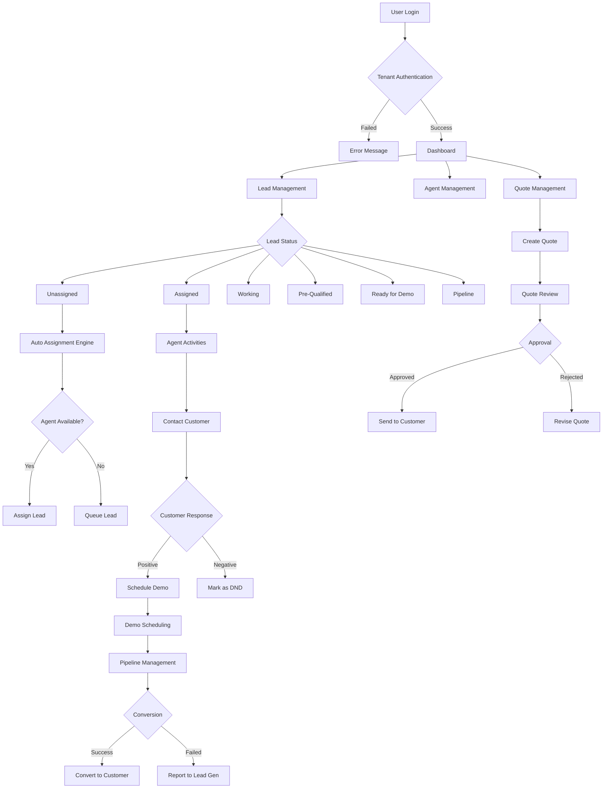
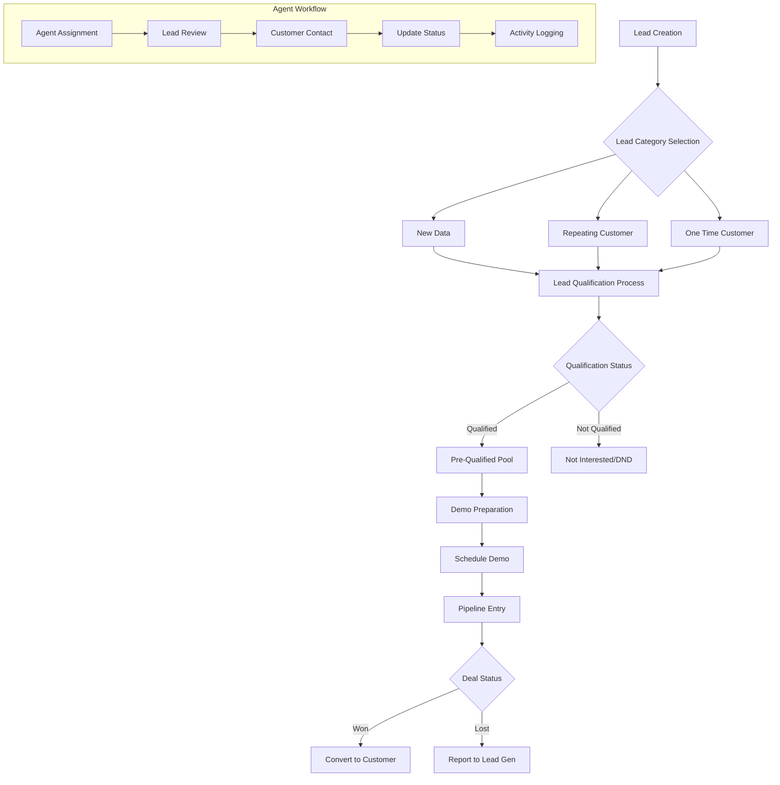
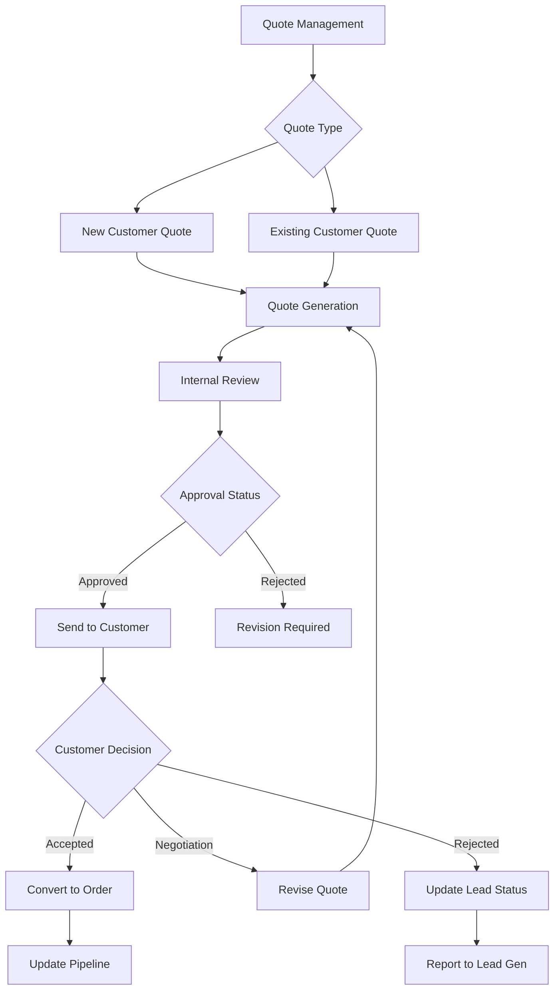
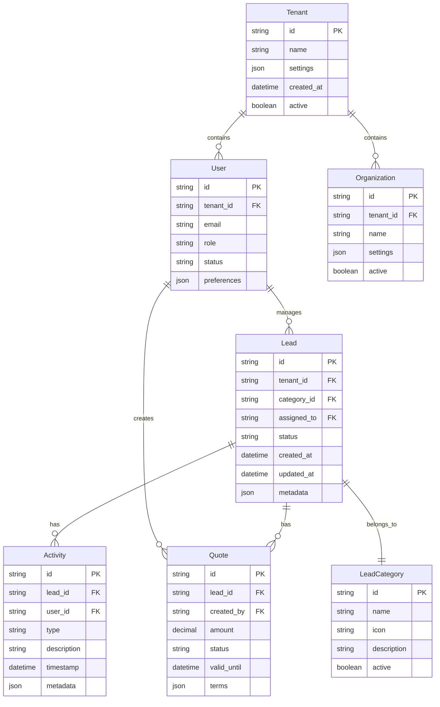
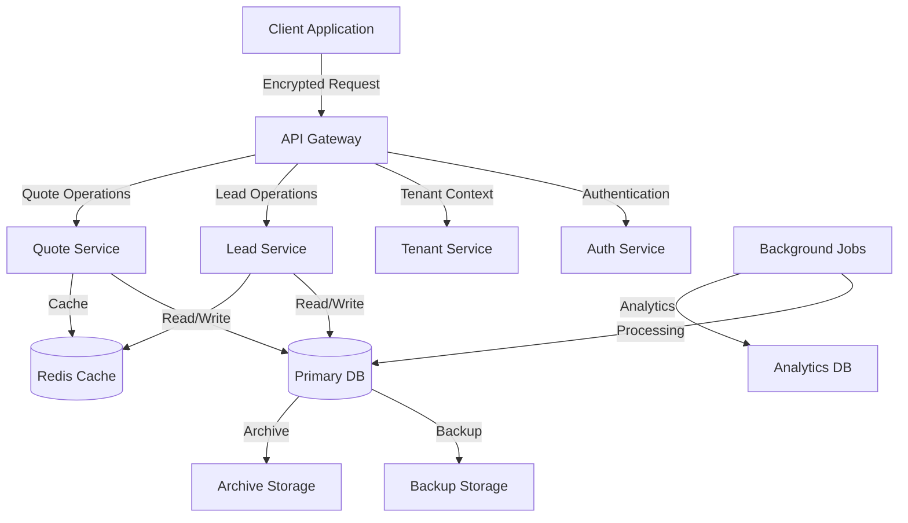

# Product Requirements Document (PRD)

# 1. INTRODUCTION

## 1.1 Purpose
This Software Requirements Specification (SRS) document provides a detailed description of the requirements for the multi-tenant Customer Relationship Management (CRM) system with comprehensive lead management capabilities. This document is intended for:
- Development team members
- Project managers
- Quality assurance teams
- System architects
- Stakeholders involved in the implementation and deployment

## 1.2 Scope
The CRM system is a web-based application built using Node.js and React, designed to manage and streamline the entire lead management lifecycle across multiple tenants. The system encompasses:

- Multi-tenant architecture supporting isolated data environments for different organizations
- Comprehensive lead management with 12 distinct lead categories
- Agent management and assignment system
- Quote generation and tracking
- Lead status tracking with visual indicators
- Pipeline management and reporting

Key functionalities include:
- Lead categorization and status management
- Automated lead assignment
- Agent performance tracking
- Quote management system
- Customer interaction history
- Lead qualification workflow
- Demo scheduling and tracking
- DND (Do Not Disturb) list management
- Lead generation reporting
- Pipeline analytics and visualization

The system aims to improve sales efficiency, lead conversion rates, and customer relationship management while maintaining data segregation between tenants.

# 2. PRODUCT DESCRIPTION

## 2.1 Product Perspective
The CRM system operates as a standalone web application within a multi-tenant cloud infrastructure. It integrates with:

- Email servers for communication
- Cloud storage for document management
- Authentication services for tenant isolation
- Analytics engines for reporting
- Calendar systems for demo scheduling

The system's architecture follows a microservices pattern with:
- Frontend tier (React)
- Backend services (Node.js)
- Database layer (tenant-isolated data stores)
- API gateway for service orchestration

## 2.2 Product Functions
The core functions include:

1. Lead Management
   - Categorization across 12 distinct states
   - Automated lead assignment
   - Status tracking with visual indicators
   - Lead qualification workflow

2. Agent Operations
   - Performance monitoring
   - Lead assignment queue
   - Activity tracking
   - Workload management

3. Quote Management
   - Quote generation
   - Version control
   - Approval workflow
   - Digital signature integration

4. Tenant Administration
   - Organization-specific configurations
   - User role management
   - Custom workflow definitions
   - Branding customization

## 2.3 User Characteristics

| User Type | Characteristics | Technical Expertise |
|-----------|----------------|-------------------|
| Sales Agents | Daily system users, handle leads and quotes | Basic to Intermediate |
| Sales Managers | Monitor team performance, manage assignments | Intermediate |
| Administrators | Configure tenant settings, manage users | Advanced |
| System Operators | Maintain platform, manage tenants | Expert |

## 2.4 Constraints

1. Technical Constraints
   - Must use Node.js for backend services
   - React for frontend development
   - RESTful API architecture
   - Tenant data isolation requirements

2. Business Constraints
   - Must support concurrent access from multiple tenants
   - Real-time data synchronization requirements
   - Compliance with data protection regulations
   - Scalability to handle growing tenant base

3. Security Constraints
   - Multi-tenant data isolation
   - Role-based access control
   - Encryption for data at rest and in transit
   - Regular security audits

## 2.5 Assumptions and Dependencies

Assumptions:
- Users have modern web browsers
- Stable internet connectivity
- Basic computer literacy
- Email system availability
- Minimum screen resolution of 1024x768

Dependencies:
- Cloud infrastructure availability
- Third-party authentication services
- Email service providers
- Database management system
- Storage service providers
- Analytics service integration

# 3. PROCESS FLOWCHART

# 4. FUNCTIONAL REQUIREMENTS

## 4.1 Lead Management Features

### F1: Lead Creation and Categorization
**Priority: High**
| Requirement ID | Description | Acceptance Criteria |
|---------------|-------------|-------------------|
| F1.1 | System must support 12 distinct lead categories with associated icons | - All categories implemented with correct icons - Visual indicators for each category - Proper categorization validation |
| F1.2 | Automated lead status transitions | - Rules engine for status changes - Audit trail of status changes - Notification system for status updates |
| F1.3 | Lead import/export functionality | - Bulk import capability - Export in multiple formats - Data validation during import |

### F2: Lead Assignment System
**Priority: High**
| Requirement ID | Description | Acceptance Criteria |
|---------------|-------------|-------------------|
| F2.1 | Automated lead distribution algorithm | - Load balancing across agents - Priority-based assignment - Agent availability checking |
| F2.2 | Manual assignment override | - Manager override capabilities - Audit logging of manual assignments - Reassignment functionality |
| F2.3 | Assignment queue management | - Queue monitoring dashboard - SLA tracking - Queue prioritization |

### F3: Agent Management
**Priority: High**
| Requirement ID | Description | Acceptance Criteria |
|---------------|-------------|-------------------|
| F3.1 | Agent performance tracking | - KPI dashboard - Real-time metrics - Historical performance data |
| F3.2 | Workload management | - Current load visualization - Capacity planning tools - Work hour tracking |
| F3.3 | Activity logging | - Automated activity tracking - Time stamps - Activity categorization |

### F4: Quote Management
**Priority: Medium**
| Requirement ID | Description | Acceptance Criteria |
|---------------|-------------|-------------------|
| F4.1 | Quote generation system | - Template-based generation - Dynamic pricing rules - Version control |
| F4.2 | Approval workflow | - Multi-level approval process - Digital signatures - Approval tracking |
| F4.3 | Quote analytics | - Success rate tracking - Quote lifecycle metrics - Revenue analytics |

### F5: Pipeline Management
**Priority: High**
| Requirement ID | Description | Acceptance Criteria |
|---------------|-------------|-------------------|
| F5.1 | Pipeline visualization | - Stage-based visualization - Progress tracking - Forecast capabilities |
| F5.2 | Conversion tracking | - Stage conversion rates - Time in stage metrics - Bottleneck identification |
| F5.3 | Revenue forecasting | - Probability-based forecasting - Pipeline value calculation - Trend analysis |

### F6: Multi-tenant Management
**Priority: Critical**
| Requirement ID | Description | Acceptance Criteria |
|---------------|-------------|-------------------|
| F6.1 | Tenant isolation | - Complete data separation - Tenant-specific configurations - Resource isolation |
| F6.2 | Tenant administration | - Tenant setup workflow - Configuration management - Billing integration |
| F6.3 | Tenant customization | - Custom fields - Workflow customization - Branding options |

### F7: Reporting and Analytics
**Priority: Medium**
| Requirement ID | Description | Acceptance Criteria |
|---------------|-------------|-------------------|
| F7.1 | Standard reports | - Pre-built report templates - Scheduled reporting - Export capabilities |
| F7.2 | Custom reporting | - Report builder interface - Custom metrics - Data visualization tools |
| F7.3 | Real-time analytics | - Live dashboards - Performance metrics - Trend analysis |

### F8: Integration Capabilities
**Priority: Medium**
| Requirement ID | Description | Acceptance Criteria |
|---------------|-------------|-------------------|
| F8.1 | Email integration | - Email tracking - Template management - Email automation |
| F8.2 | Calendar integration | - Demo scheduling - Availability management - Calendar sync |
| F8.3 | Document management | - Document storage - Version control - Access control |

# 5. NON-FUNCTIONAL REQUIREMENTS

## 5.1 Performance Requirements

| Requirement | Description | Target Metric |
|-------------|-------------|---------------|
| Response Time | Maximum time for page loads and API responses | < 2 seconds at 95th percentile |
| Database Query Performance | Maximum time for complex queries | < 500ms for 90% of queries |
| Concurrent Users | System must handle simultaneous users per tenant | 500 concurrent users per tenant |
| API Throughput | Number of API requests handled | 1000 requests per second |
| Resource Utilization | CPU and memory usage under normal load | < 70% CPU, < 80% memory |
| Background Jobs | Maximum time for batch processing | < 5 minutes for 10,000 records |

## 5.2 Safety Requirements

| Requirement | Description | Implementation |
|-------------|-------------|----------------|
| Data Backup | Regular automated backups | Hourly incremental, daily full backups |
| Disaster Recovery | Recovery point and time objectives | RPO: 1 hour, RTO: 4 hours |
| System Monitoring | Real-time monitoring and alerting | 24/7 monitoring with incident alerts |
| Fault Tolerance | System behavior during component failures | Graceful degradation of services |
| Data Validation | Input validation and sanitization | Server-side validation for all inputs |
| Error Handling | Comprehensive error management | Structured error logging and reporting |

## 5.3 Security Requirements

| Requirement | Description | Implementation |
|-------------|-------------|----------------|
| Authentication | User identity verification | Multi-factor authentication |
| Authorization | Role-based access control | Granular permission system |
| Data Encryption | Protection of sensitive data | AES-256 encryption at rest and in transit |
| Session Management | Secure session handling | JWT with appropriate expiration |
| Audit Logging | Security event tracking | Comprehensive audit trail |
| Tenant Isolation | Data separation between tenants | Row-level security in database |
| API Security | API endpoint protection | OAuth 2.0 with rate limiting |
| Password Policy | Password strength requirements | Minimum 12 characters, complexity rules |

## 5.4 Quality Requirements

### 5.4.1 Availability
- System uptime: 99.9% (excluding planned maintenance)
- Maximum planned downtime: 4 hours per month
- Automated failover capabilities
- Load balancing across multiple servers

### 5.4.2 Maintainability
- Modular architecture with clear separation of concerns
- Comprehensive documentation
- Automated deployment pipeline
- Code coverage minimum: 80%
- Regular dependency updates

### 5.4.3 Usability
- Intuitive user interface following Material Design principles
- Maximum of 3 clicks to reach any feature
- Responsive design for all screen sizes
- Accessibility compliance with WCAG 2.1 Level AA
- Multi-language support

### 5.4.4 Scalability
- Horizontal scaling capability
- Auto-scaling based on load
- Database sharding support
- Microservices architecture
- Caching layer implementation

### 5.4.5 Reliability
- Mean Time Between Failures (MTBF): > 720 hours
- Mean Time To Recovery (MTTR): < 30 minutes
- Automated system health checks
- Circuit breaker implementation for external services
- Data consistency checks

## 5.5 Compliance Requirements

| Requirement | Description | Implementation |
|-------------|-------------|----------------|
| Data Protection | GDPR compliance | Data privacy controls and documentation |
| Data Residency | Regional data storage requirements | Configurable data center selection |
| Industry Standards | CRM security standards | ISO 27001 compliance |
| Accessibility | Web accessibility standards | WCAG 2.1 Level AA compliance |
| Audit Requirements | Regular security audits | Quarterly security assessments |
| Data Retention | Data retention policies | Configurable retention periods |
| Export Controls | Data export capabilities | Standardized export formats |
| Documentation | Compliance documentation | Maintained compliance records |

# 6. DATA REQUIREMENTS

## 6.1 Data Models

## 6.2 Data Storage

### 6.2.1 Primary Storage
- MongoDB as primary database with tenant-specific collections
- Sharded clusters for horizontal scalability
- Separate databases per tenant for complete isolation
- Indexed collections for lead categories and status

### 6.2.2 Data Retention
| Data Type | Retention Period | Archive Policy |
|-----------|------------------|----------------|
| Active Leads | Indefinite | None |
| Closed Leads | 3 years | Yearly archive |
| Activities | 2 years | Quarterly archive |
| Quotes | 7 years | Yearly archive |
| Audit Logs | 5 years | Monthly archive |

### 6.2.3 Backup Strategy
- Hourly incremental backups
- Daily full backups
- Weekly consolidated backups
- Geo-redundant backup storage
- 30-day backup retention
- Point-in-time recovery capability

### 6.2.4 Data Redundancy
- Multi-region database replication
- Minimum 3 replicas per shard
- Automatic failover configuration
- Cross-region disaster recovery setup

## 6.3 Data Processing

### 6.3.1 Data Flow

### 6.3.2 Data Security
| Layer | Security Measure | Implementation |
|-------|-----------------|----------------|
| Transport | TLS 1.3 | End-to-end encryption |
| Storage | AES-256 | Field-level encryption |
| Application | Row-level security | Tenant isolation |
| Database | Encrypted at rest | Volume encryption |
| Backup | Encrypted backups | Key rotation |

### 6.3.3 Data Validation
- Schema validation at database level
- Application-level input validation
- Data type enforcement
- Business rule validation
- Cross-field validation rules

### 6.3.4 Data Integration
- REST API endpoints for external systems
- Webhook support for real-time updates
- Batch processing capabilities
- ETL pipelines for data migration
- Data synchronization protocols

# 7. EXTERNAL INTERFACES

## 7.1 User Interfaces

### 7.1.1 General Requirements
- Material Design implementation for consistent UI
- Responsive design supporting desktop and tablet devices
- Minimum resolution support: 1024x768
- Dark/light theme support
- Customizable tenant branding elements

### 7.1.2 Layout Components

| Component | Description | Key Features |
|-----------|-------------|--------------|
| Navigation Bar | Top-fixed navigation | - Tenant branding area - Quick actions menu - User profile access - Notifications center |
| Sidebar Menu | Collapsible side menu | - Category-based navigation - Icon-based indicators - Status counters - Quick filters |
| Lead Dashboard | Main workspace | - Kanban board view - List view option - Status-based columns - Drag-drop support |
| Quick Actions | Floating action button | - Lead creation - Quote generation - Demo scheduling - Contact actions |

### 7.1.3 Lead Category Visual System

| Category | Icon | Color Code |
|----------|------|------------|
| All Leads | spatial_audio | #6200EA |
| Un-Assigned | assignment_ind | #D32F2F |
| Assigned | shield_moon | #388E3C |
| New Data | headset_mic | #1976D2 |
| Working On | data_exploration | #FFA000 |
| Pre Qualified | data_exploration | #00796B |
| Repeating Customer | data_exploration | #5E35B1 |
| One Time Customer | face_5 | #C2185B |
| Not Interested/DND | shield_moon | #455A64 |
| Report to Lead Gen | blanket | #F4511E |
| Ready for Demo | readiness_score | #0097A7 |
| Pipeline | data_exploration | #689F38 |

## 7.2 Software Interfaces

### 7.2.1 Frontend Integration

| Interface | Technology | Purpose |
|-----------|------------|----------|
| React Components | React 18+ | UI component library |
| State Management | Redux | Application state handling |
| API Client | Axios | REST API communication |
| UI Framework | Material-UI | Component styling |
| Form Handling | Formik | Form management and validation |

### 7.2.2 Backend Services

| Service | Technology | Interface Type |
|---------|------------|---------------|
| Authentication | JWT/OAuth2.0 | REST API |
| Database | MongoDB | Native Driver |
| Caching | Redis | Redis Client |
| Search | Elasticsearch | REST API |
| File Storage | AWS S3 | SDK |
| Email Service | SendGrid | REST API |

### 7.2.3 External Integrations

| System | Protocol | Data Format |
|--------|----------|-------------|
| Calendar Services | REST/OAuth2.0 | JSON |
| Email Providers | SMTP/API | MIME/JSON |
| Document Storage | S3 API | Binary/JSON |
| Analytics Services | REST | JSON |
| Payment Gateways | REST | JSON |

## 7.3 Communication Interfaces

### 7.3.1 API Specifications

| Interface Type | Protocol | Security |
|---------------|----------|-----------|
| REST API | HTTPS | JWT + OAuth2.0 |
| WebSocket | WSS | Token-based |
| GraphQL | HTTPS | JWT |

### 7.3.2 Data Exchange Formats

| Format | Use Case | Validation |
|--------|----------|------------|
| JSON | API Responses | JSON Schema |
| CSV | Data Export | RFC 4180 |
| PDF | Document Generation | PDF/A |
| XML | Legacy Integration | XSD Schema |

### 7.3.3 Network Requirements

| Requirement | Specification | Notes |
|-------------|---------------|--------|
| Bandwidth | 10Mbps minimum | Per tenant |
| Latency | <100ms | Client to server |
| Ports | 443, 80 | HTTPS/HTTP |
| WebSocket | 443 | Real-time updates |

## 7.4 Hardware Interfaces

### 7.4.1 Client Requirements

| Component | Minimum Specification |
|-----------|---------------------|
| CPU | Dual Core 2GHz |
| RAM | 4GB |
| Display | 1024x768 resolution |
| Network | 10Mbps connection |
| Storage | 1GB available space |

### 7.4.2 Server Infrastructure

| Component | Specification |
|-----------|--------------|
| Load Balancer | AWS ALB/NLB |
| Application Servers | AWS EC2 t3.large |
| Database Servers | MongoDB Atlas M30 |
| Cache Servers | Redis Enterprise |
| Storage | AWS S3 Standard |

# 8. APPENDICES

## 8.1 GLOSSARY

| Term | Definition |
|------|------------|
| Lead | A potential sales opportunity or prospect in the system |
| Tenant | An organization or entity with its own isolated instance of the CRM |
| Pipeline | The sales process from lead generation to conversion |
| DND | Do Not Disturb - leads marked as not to be contacted |
| Pre-Qualified | Leads that have met initial qualification criteria |
| Quote | A formal pricing proposal generated for a lead |
| Agent | A sales representative who works with leads |
| Demo | Product demonstration session with a potential customer |
| Lead Gen | Lead Generation - the process of creating new sales opportunities |
| Working On | Active leads currently being pursued by agents |

## 8.2 ACRONYMS

| Acronym | Expansion |
|---------|-----------|
| API | Application Programming Interface |
| CRM | Customer Relationship Management |
| JWT | JSON Web Token |
| REST | Representational State Transfer |
| SLA | Service Level Agreement |
| KPI | Key Performance Indicator |
| UI | User Interface |
| RPO | Recovery Point Objective |
| RTO | Recovery Time Objective |
| MTBF | Mean Time Between Failures |
| MTTR | Mean Time To Recovery |
| ETL | Extract, Transform, Load |
| WCAG | Web Content Accessibility Guidelines |

## 8.3 ADDITIONAL REFERENCES

| Reference | Description | URL |
|-----------|-------------|-----|
| React Documentation | Official React.js documentation | https://reactjs.org/docs |
| Node.js Documentation | Official Node.js documentation | https://nodejs.org/docs |
| MongoDB Documentation | MongoDB database documentation | https://docs.mongodb.com |
| Material-UI Guidelines | Material Design implementation guide | https://material.io/design |
| OAuth 2.0 Specification | Authentication protocol specification | https://oauth.net/2/ |
| JWT Standard | JSON Web Token standard | https://jwt.io/ |
| Redis Documentation | Redis caching system documentation | https://redis.io/documentation |
| AWS S3 Documentation | Amazon S3 storage service documentation | https://docs.aws.amazon.com/s3 |

## 8.4 ICONS AND VISUAL ELEMENTS

| Element Type | Source | License |
|--------------|--------|---------|
| Material Icons | Google Material Design Icons | Apache License 2.0 |
| UI Components | Material-UI Library | MIT License |
| Custom Icons | Project Assets | Proprietary |
| Color Palette | Material Design Color System | Open Source |

## 8.5 DEVELOPMENT TOOLS

| Tool Category | Recommended Tools |
|---------------|------------------|
| IDE | Visual Studio Code, WebStorm |
| Version Control | Git, GitHub |
| API Testing | Postman, Insomnia |
| Code Quality | ESLint, Prettier |
| Testing | Jest, React Testing Library |
| Build Tools | Webpack, Babel |
| CI/CD | Jenkins, GitHub Actions |
| Monitoring | New Relic, Datadog |

## 8.6 ENVIRONMENT SETUP

| Environment | Purpose | Configuration |
|-------------|---------|---------------|
| Development | Local development | Node.js 16+, MongoDB Community Edition |
| Testing | QA and testing | Containerized services, Test databases |
| Staging | Pre-production validation | Production-like environment |
| Production | Live system | High-availability cluster |