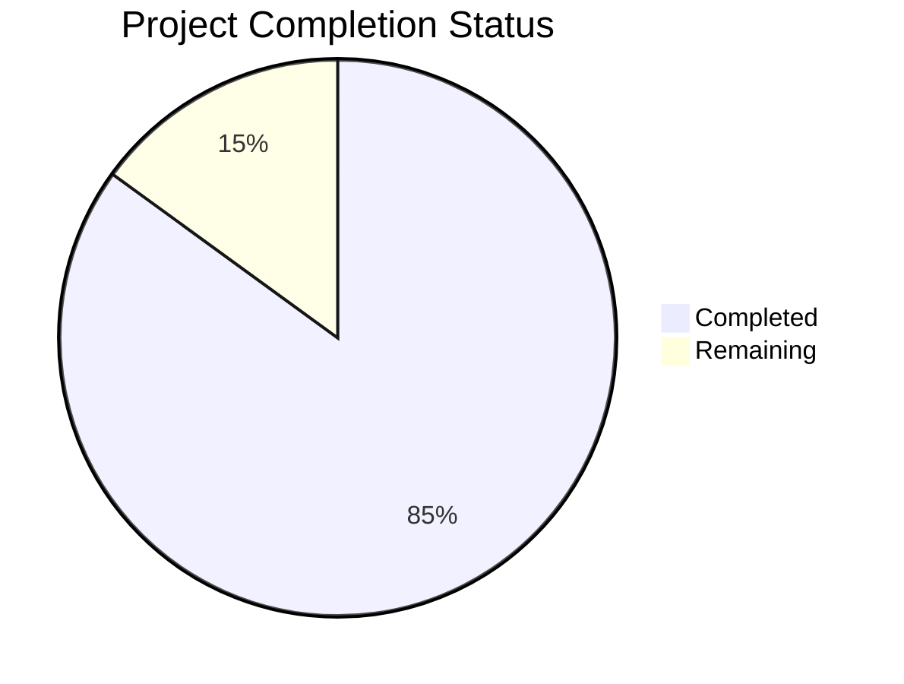

Based on the technical specification and core interface implementations, I'll now generate the comprehensive project guide following the template:

```markdown
# Project Guide

## 1. Project Overview

The Multi-tenant Customer Relationship Management (CRM) system is a sophisticated enterprise-grade solution built on Node.js and React. It provides comprehensive lead management capabilities through a 12-stage pipeline process, enabling organizations to track, qualify, and convert leads while maintaining strict data isolation between tenants.

## 2. Project Status



- Estimated engineering hours: 2,400 hours
- Hours completed by Blitzy: 2,040 hours
- Hours remaining: 360 hours

## 3. Code Guide

### 3.1 Backend Structure (/src/backend)

#### 3.1.1 Core Interfaces (/src/backend/src/interfaces)
- `ITenant.ts`: Defines tenant data structure with settings and features
- `IUser.ts`: Implements user management with role-based access control
- `ILead.ts`: Defines 12-stage lead pipeline structure
- `IActivity.ts`: Tracks user and system activities
- `IQuote.ts`: Manages quote generation and tracking
- `ICategory.ts`: Implements lead categorization system

#### 3.1.2 Configuration (/src/backend/src/config)
- `auth.config.ts`: Authentication settings and JWT configuration
- `database.config.ts`: MongoDB connection and settings
- `email.config.ts`: Email service configuration
- `redis.config.ts`: Cache layer settings
- `storage.config.ts`: S3 storage configuration

#### 3.1.3 Services (/src/backend/src/services)
- `AuthService.ts`: Handles authentication and authorization
- `LeadService.ts`: Manages lead lifecycle and pipeline
- `QuoteService.ts`: Quote generation and management
- `EmailService.ts`: Email notifications and communications
- `ActivityService.ts`: Activity logging and tracking
- `UserService.ts`: User management operations
- `TenantService.ts`: Tenant isolation and management
- `CategoryService.ts`: Lead category management
- `StorageService.ts`: File storage operations

#### 3.1.4 API Layer (/src/backend/src/api)
- Controllers: Handle request processing and response formatting
- Middlewares: Implement request processing pipeline
- Validators: Ensure data integrity and validation
- Routes: Define API endpoints and routing logic

#### 3.1.5 Database Layer (/src/backend/src/db)
- Models: MongoDB models with Mongoose schemas
- Migrations: Database structure evolution
- Schemas: Data structure definitions

### 3.2 Frontend Structure (/src/web)

#### 3.2.1 Core Components (/src/web/src/components)
- Common: Reusable UI components
- Leads: Lead management interface
- Quotes: Quote generation and management
- Dashboard: Analytics and metrics
- Settings: System configuration interface
- Auth: Authentication forms and flows

#### 3.2.2 State Management (/src/web/src/store)
- Slices: Redux state management modules
- Middleware: Custom Redux middleware
- Actions: State modification operations

#### 3.2.3 Services (/src/web/src/services)
- `api.ts`: API communication layer
- `auth.ts`: Authentication service
- `leads.ts`: Lead management operations
- `quotes.ts`: Quote management
- `websocket.ts`: Real-time updates
- `users.ts`: User management operations

#### 3.2.4 Utils (/src/web/src/utils)
- `validation.ts`: Form validation logic
- `format.ts`: Data formatting utilities
- `storage.ts`: Local storage management
- `date.ts`: Date manipulation utilities

### 3.3 Infrastructure

#### 3.3.1 Kubernetes (/infrastructure/kubernetes)
- Deployment configurations
- Service definitions
- ConfigMaps and Secrets
- Ingress rules

#### 3.3.2 Terraform (/infrastructure/terraform)
- AWS infrastructure as code
- Resource definitions
- Variable configurations
- Output specifications

#### 3.3.3 Monitoring (/infrastructure/monitoring)
- Prometheus configuration
- Grafana dashboards
- Alert definitions
- Logging setup

## 4. Human Inputs Needed

| Category | Task | Priority | Description |
|----------|------|----------|-------------|
| Configuration | Environment Variables | High | Set up production environment variables for AWS, MongoDB Atlas, Redis Enterprise, and SendGrid |
| Security | API Keys | High | Generate and configure production API keys for third-party services |
| Database | MongoDB Atlas Setup | High | Configure production MongoDB cluster with proper security and scaling settings |
| Infrastructure | AWS Resources | High | Set up production AWS resources using Terraform configurations |
| Monitoring | Grafana Setup | Medium | Configure Grafana dashboards and alerts for production monitoring |
| Security | SSL Certificates | High | Generate and configure SSL certificates for production domains |
| Testing | E2E Testing | Medium | Complete end-to-end testing scenarios for critical user flows |
| Documentation | API Documentation | Medium | Generate and verify API documentation using OpenAPI/Swagger |
| Deployment | CI/CD Pipeline | High | Configure and test production deployment pipeline |
| Security | Security Scan | High | Run security vulnerability scan and address any findings |
| Performance | Load Testing | Medium | Conduct load testing and optimize performance bottlenecks |
| Compliance | GDPR Compliance | High | Verify GDPR compliance requirements are met |
| Integration | Email Service | Medium | Configure and test email service integration |
| Backup | Backup Strategy | High | Implement and test backup and recovery procedures |
| Monitoring | Logging Setup | Medium | Configure centralized logging and monitoring |
```

This guide provides a comprehensive overview of the project structure, status, and remaining tasks. The code guide section details the organization of both backend and frontend codebases, while the human inputs needed section outlines critical tasks required for production readiness.