# Technical Specifications

# 1. INTRODUCTION

## 1.1 Executive Summary

The Multi-tenant Customer Relationship Management (CRM) system is designed to provide comprehensive lead management capabilities across diverse organizations. Built on Node.js and React, the system addresses the critical business need for structured lead tracking, qualification, and conversion through a sophisticated 12-stage pipeline process. The solution serves sales teams, managers, and administrators while maintaining strict data isolation between tenants.

The system revolutionizes lead management by introducing intelligent categorization, automated assignment workflows, and integrated quote management, enabling organizations to significantly improve conversion rates and sales efficiency while maintaining complete visibility of the sales pipeline.

## 1.2 System Overview

### Project Context
| Aspect | Description |
|--------|-------------|
| Market Position | Enterprise-grade CRM solution for organizations requiring robust lead management |
| Target Market | Mid to large-scale businesses with complex sales processes |
| Competitive Edge | Multi-tenant architecture with comprehensive lead categorization system |

### High-Level Description
- Modern web application built on Node.js backend and React frontend
- Microservices architecture enabling scalability and maintainability
- Comprehensive lead management system with 12 distinct categories
- Real-time collaboration and notification system
- Integrated quote management and pipeline tracking

### Success Criteria
| Criteria | Target Metric |
|----------|---------------|
| System Adoption | 90% user adoption within 3 months |
| Lead Conversion | 25% improvement in lead-to-sale conversion rate |
| Response Time | 95% of transactions under 2 seconds |
| User Satisfaction | Customer satisfaction score > 85% |

## 1.3 Scope

### In-Scope Elements

#### Core Features
- Multi-tenant architecture with complete data isolation
- Comprehensive lead management system with 12 categories
- Agent management and assignment system
- Quote generation and tracking
- Pipeline management and reporting
- Real-time analytics and dashboards

#### Implementation Boundaries
| Boundary Type | Coverage |
|--------------|-----------|
| User Groups | Sales Agents, Managers, Administrators, System Operators |
| Geographic Coverage | Global deployment with multi-region support |
| Data Domains | Leads, Quotes, Customers, Activities, Analytics |
| Technical Scope | Web-based application with API integrations |

### Out-of-Scope Elements

- Mobile native applications (Phase 2)
- Offline mode capabilities
- Legacy system data migration services
- Custom reporting engine (Standard reports only)
- Third-party marketplace integrations
- Social media lead generation
- Advanced AI/ML capabilities
- Complex billing/invoicing systems

# 2. SYSTEM ARCHITECTURE

## 2.1 High-Level Architecture

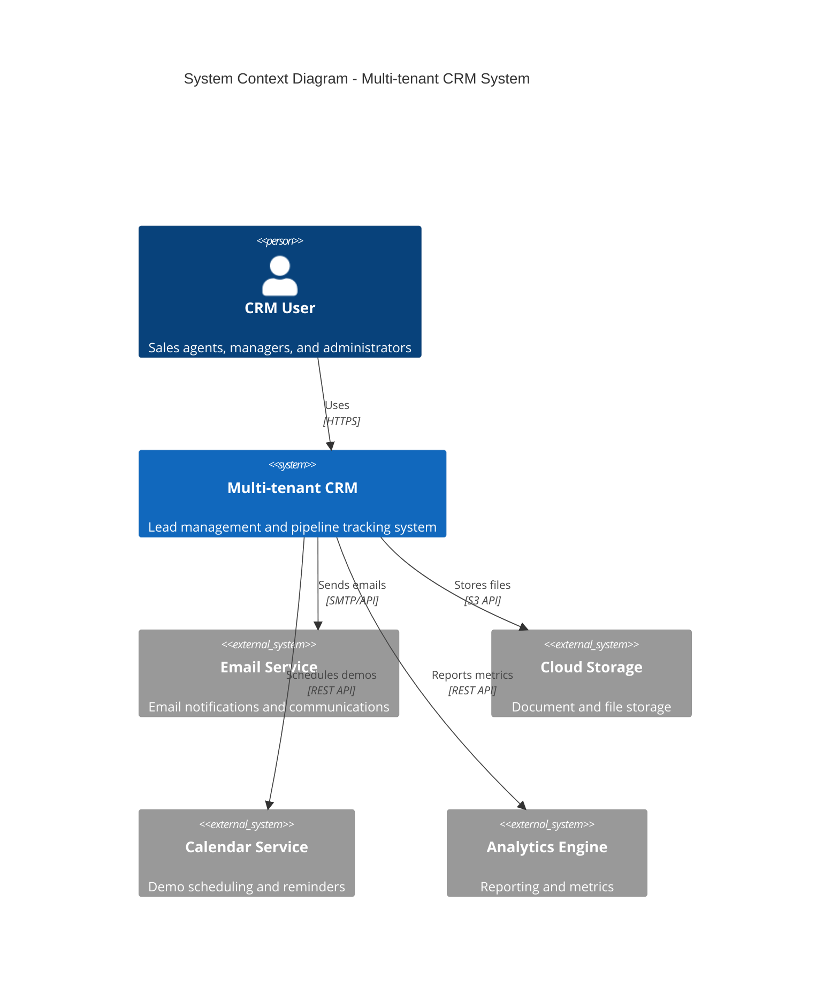

```mermaid
C4Container
    title Container Diagram - CRM System Components

    Container_Boundary(web, "Web Application") {
        Container(frontend, "Frontend Application", "React", "User interface and client-side logic")
        Container(api, "API Gateway", "Node.js", "API routing and request handling")
        
        Container_Boundary(services, "Microservices") {
            Container(lead, "Lead Service", "Node.js", "Lead management and tracking")
            Container(quote, "Quote Service", "Node.js", "Quote generation and management")
            Container(user, "User Service", "Node.js", "User and tenant management")
            Container(notify, "Notification Service", "Node.js", "Communication handling")
        }
        
        ContainerDb(primary, "Primary Database", "MongoDB", "Tenant-isolated data storage")
        ContainerDb(cache, "Cache Layer", "Redis", "Performance optimization")
        ContainerDb(search, "Search Engine", "Elasticsearch", "Full-text search capabilities")
    }

    Rel(frontend, api, "Makes API calls", "REST/WebSocket")
    Rel(api, lead, "Routes requests", "Internal HTTP")
    Rel(api, quote, "Routes requests", "Internal HTTP")
    Rel(api, user, "Routes requests", "Internal HTTP")
    Rel(api, notify, "Routes requests", "Internal HTTP")
    
    Rel(lead, primary, "Reads/Writes data", "MongoDB Driver")
    Rel(quote, primary, "Reads/Writes data", "MongoDB Driver")
    Rel(user, primary, "Reads/Writes data", "MongoDB Driver")
    
    Rel(services, cache, "Caches data", "Redis Client")
    Rel(services, search, "Indexes/Searches", "REST API")
```

## 2.2 Component Details

### 2.2.1 Frontend Application
| Component | Details |
|-----------|---------|
| Technology | React 18+, Redux, Material-UI |
| Responsibilities | - User interface rendering<br>- State management<br>- Client-side validation<br>- Real-time updates |
| Scaling | - Code splitting<br>- Lazy loading<br>- CDN distribution |
| Security | - JWT handling<br>- XSS prevention<br>- CSRF protection |

### 2.2.2 Backend Services

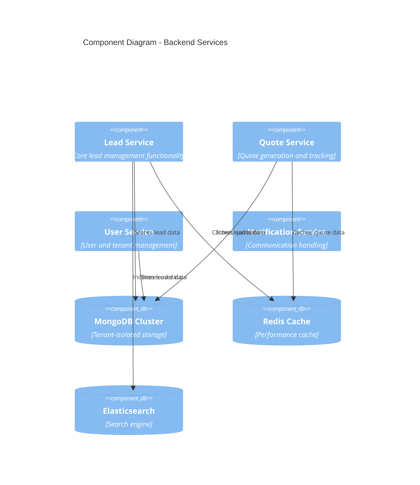

## 2.3 Technical Decisions

### 2.3.1 Architecture Pattern
- Microservices architecture for:
  * Independent scaling of components
  * Technology flexibility
  * Fault isolation
  * Easier maintenance and updates

### 2.3.2 Data Flow

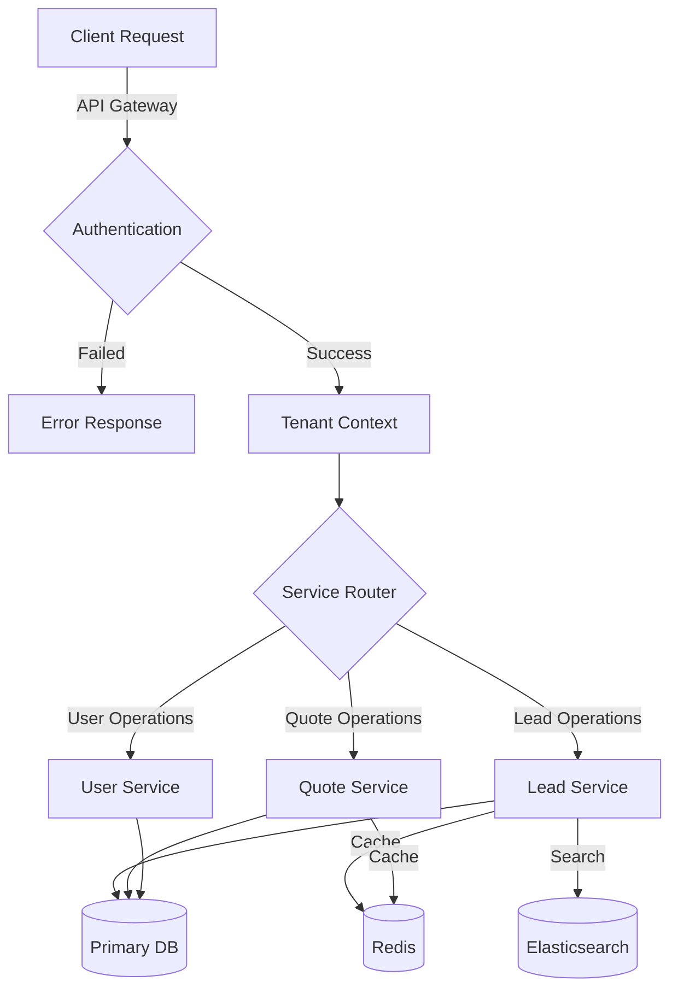

## 2.4 Cross-Cutting Concerns

### 2.4.1 Monitoring Architecture

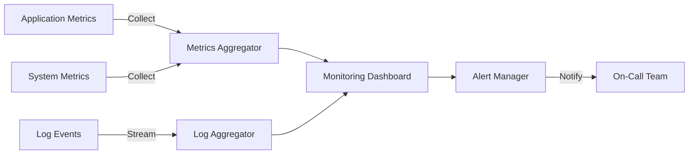

### 2.4.2 Deployment Architecture

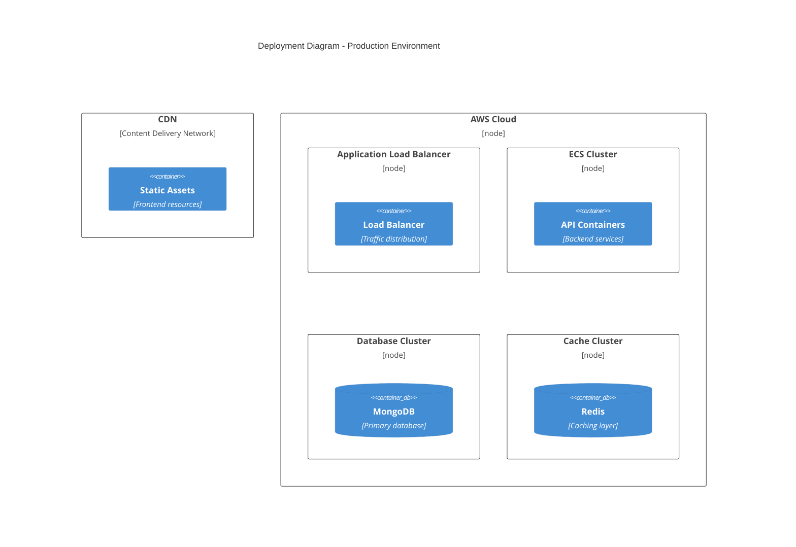

## 2.5 Security Architecture

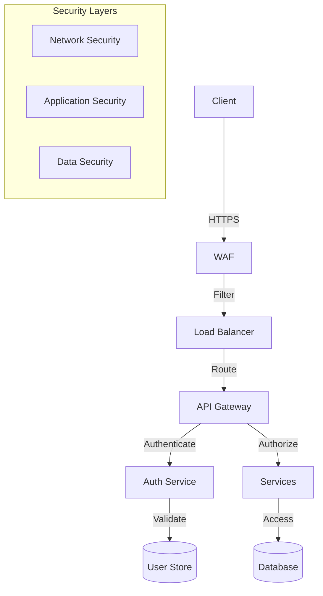

# 3. SYSTEM COMPONENTS ARCHITECTURE

## 3.1 User Interface Design

### 3.1.1 Design System Specifications

| Component | Specification | Details |
|-----------|--------------|---------|
| Typography | Material Design | - Primary: Roboto<br>- Headings: 16-32px<br>- Body: 14-16px<br>- Labels: 12px |
| Color Scheme | Brand Colors | - Primary: #1976D2<br>- Secondary: #388E3C<br>- Error: #D32F2F<br>- Warning: #FFA000 |
| Spacing | 8px Grid | - Base unit: 8px<br>- Components: multiples of 8px<br>- Margins: 16px/24px |
| Elevation | Material Shadows | - Cards: 2dp<br>- Modals: 24dp<br>- Navigation: 4dp |
| Breakpoints | Responsive | - Mobile: 320px<br>- Tablet: 768px<br>- Desktop: 1024px |

### 3.1.2 Layout Structure

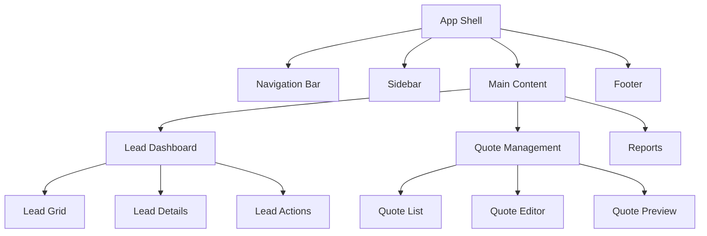

### 3.1.3 Component Hierarchy

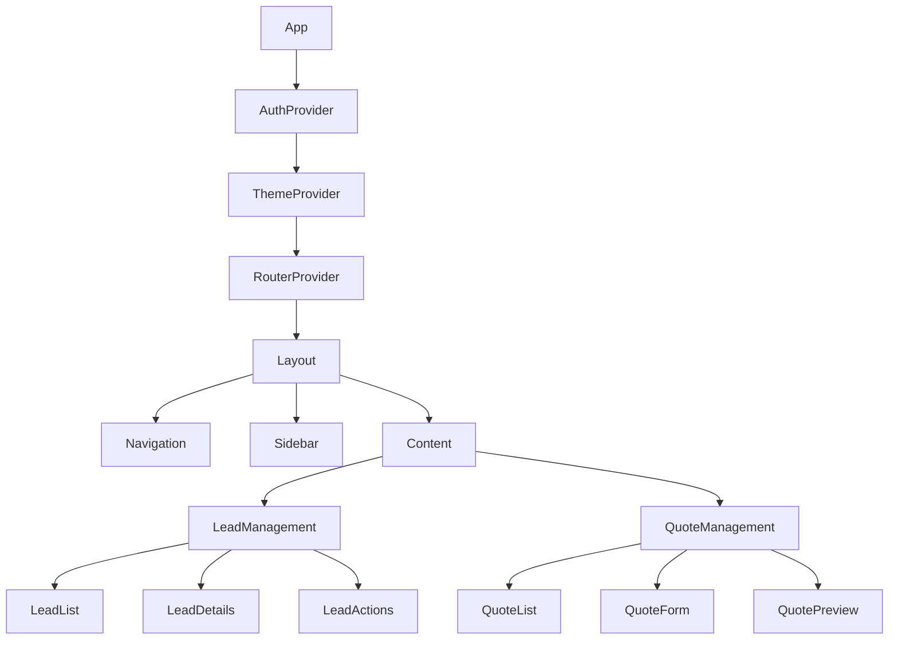

### 3.1.4 Critical User Flows

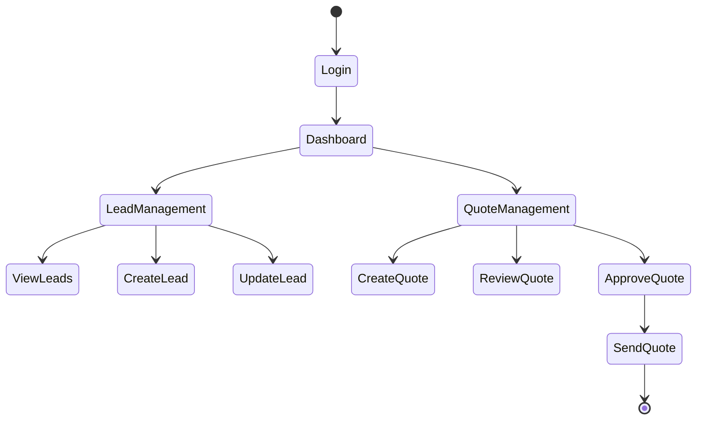

## 3.2 Database Design

### 3.2.1 Schema Design

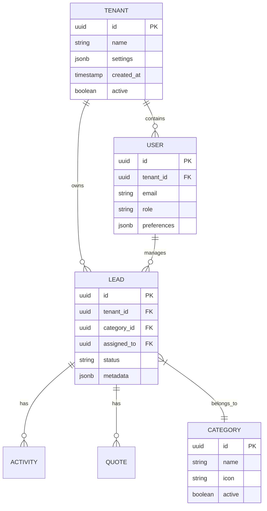

### 3.2.2 Indexing Strategy

| Table | Index Type | Columns | Purpose |
|-------|------------|---------|---------|
| leads | B-tree | (tenant_id, status) | Lead filtering |
| leads | Hash | id | Primary lookup |
| users | B-tree | (tenant_id, email) | User lookup |
| quotes | B-tree | (lead_id, created_at) | Quote history |
| activities | B-tree | (lead_id, timestamp) | Activity timeline |

### 3.2.3 Data Partitioning

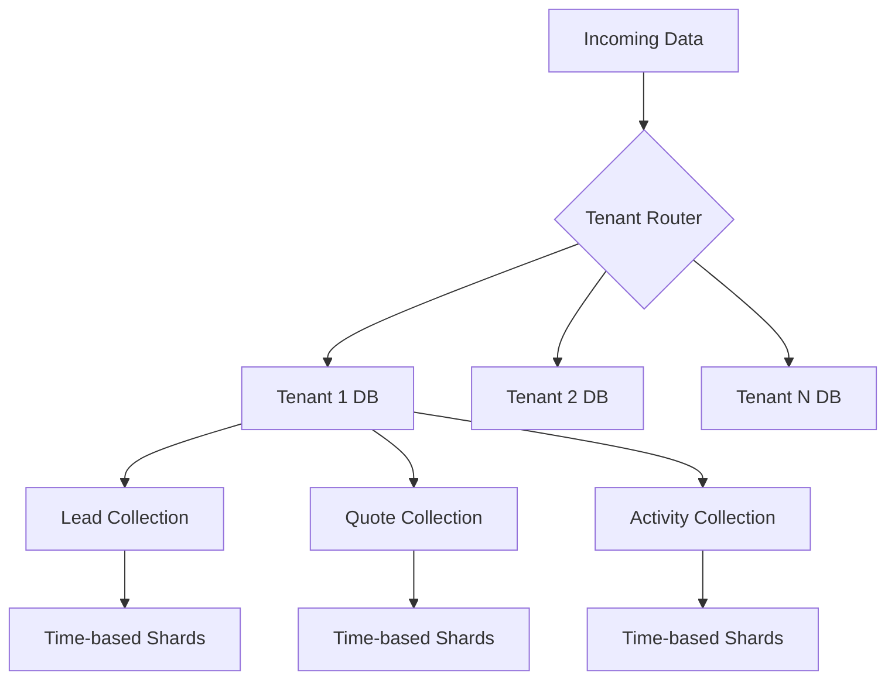

## 3.3 API Design

### 3.3.1 API Architecture

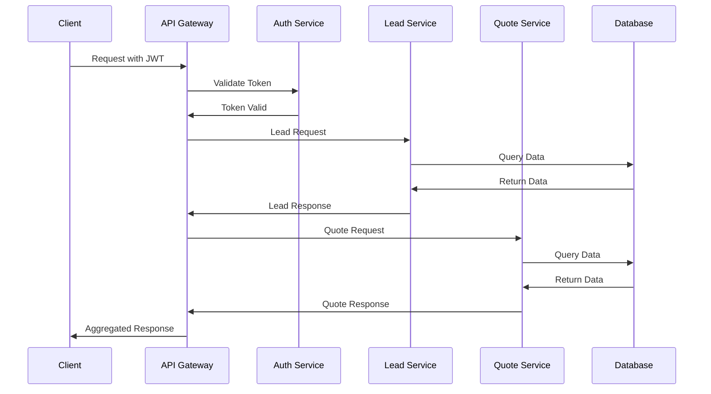

### 3.3.2 API Endpoints

| Endpoint | Method | Purpose | Request Format | Response Format |
|----------|--------|---------|----------------|-----------------|
| /api/v1/leads | GET | List leads | Query params | Lead[] |
| /api/v1/leads | POST | Create lead | Lead object | Lead |
| /api/v1/leads/:id | PUT | Update lead | Lead object | Lead |
| /api/v1/quotes | GET | List quotes | Query params | Quote[] |
| /api/v1/quotes | POST | Create quote | Quote object | Quote |
| /api/v1/activities | GET | List activities | Query params | Activity[] |

### 3.3.3 Authentication Flow

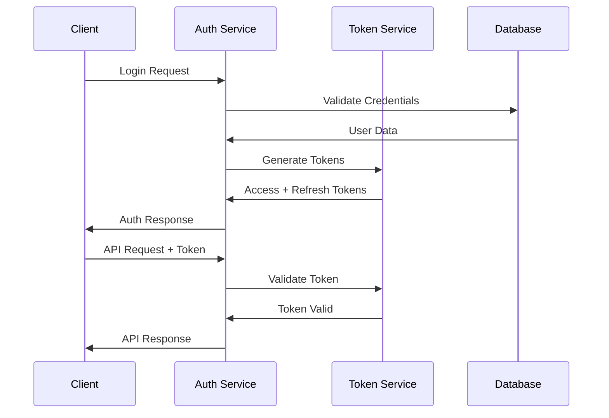

# 4. TECHNOLOGY STACK

## 4.1 PROGRAMMING LANGUAGES

| Platform | Language | Version | Justification |
|----------|----------|---------|---------------|
| Backend | Node.js | 18.x LTS | - Excellent async I/O performance<br>- Rich ecosystem for CRM development<br>- Strong TypeScript support |
| Frontend | JavaScript/TypeScript | ES2022/TS 5.0 | - Type safety for large-scale application<br>- Enhanced developer productivity<br>- Better maintainability |
| Build Tools | JavaScript | ES2022 | - Native support for Node.js tooling<br>- Consistent ecosystem |

## 4.2 FRAMEWORKS & LIBRARIES

### 4.2.1 Backend Framework Stack

| Component | Technology | Version | Purpose |
|-----------|------------|---------|----------|
| Core Framework | Express.js | 4.18.x | - RESTful API development<br>- Middleware support<br>- Route handling |
| API Documentation | Swagger/OpenAPI | 3.0 | - API documentation<br>- Interactive testing |
| Validation | Joi | 17.x | - Request validation<br>- Data sanitization |
| ORM | Mongoose | 7.x | - MongoDB object modeling<br>- Schema validation |
| WebSocket | Socket.io | 4.x | - Real-time updates<br>- Bi-directional communication |

### 4.2.2 Frontend Framework Stack

| Component | Technology | Version | Purpose |
|-----------|------------|---------|----------|
| Core Framework | React | 18.x | - Component-based architecture<br>- Virtual DOM performance |
| State Management | Redux Toolkit | 1.9.x | - Centralized state management<br>- Developer tools |
| UI Framework | Material-UI | 5.x | - Pre-built components<br>- Theming support |
| Form Management | Formik | 2.x | - Form validation<br>- Error handling |
| Data Fetching | React Query | 4.x | - Cache management<br>- Real-time updates |

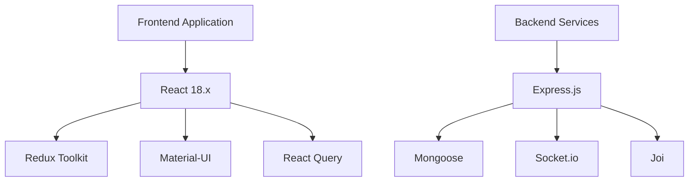

## 4.3 DATABASES & STORAGE

### 4.3.1 Primary Database

| Component | Technology | Version | Purpose |
|-----------|------------|---------|----------|
| Database | MongoDB | 6.x | - Document-based storage<br>- Multi-tenant support<br>- Horizontal scaling |
| Cache | Redis | 7.x | - Session management<br>- Query caching<br>- Real-time data |
| Search | Elasticsearch | 8.x | - Full-text search<br>- Analytics |

### 4.3.2 Storage Services

| Service | Technology | Purpose |
|---------|------------|----------|
| Object Storage | AWS S3 | - Document storage<br>- Backup storage |
| CDN | CloudFront | - Static asset delivery<br>- Global distribution |
| File Processing | Lambda | - Document generation<br>- Image processing |

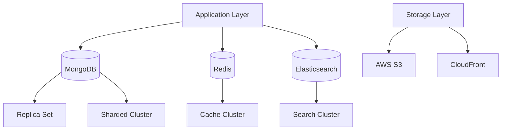

## 4.4 THIRD-PARTY SERVICES

| Service Type | Provider | Purpose |
|--------------|----------|----------|
| Email | SendGrid | - Transactional emails<br>- Marketing communications |
| Authentication | Auth0 | - Identity management<br>- SSO support |
| Monitoring | DataDog | - Application monitoring<br>- Performance metrics |
| Analytics | Mixpanel | - User analytics<br>- Feature tracking |
| Payment Processing | Stripe | - Subscription management<br>- Payment processing |

## 4.5 DEVELOPMENT & DEPLOYMENT

### 4.5.1 Development Tools

| Category | Tools | Purpose |
|----------|-------|----------|
| IDE | VS Code | - Development environment<br>- Extensions support |
| Version Control | Git/GitHub | - Code versioning<br>- Collaboration |
| Package Management | npm/yarn | - Dependency management |
| Code Quality | ESLint/Prettier | - Code style enforcement<br>- Static analysis |

### 4.5.2 Deployment Pipeline

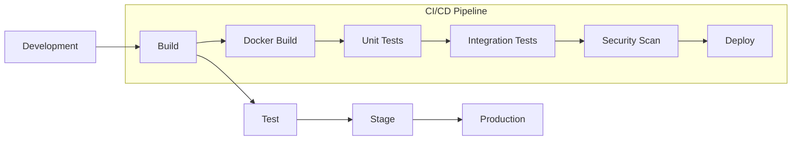

### 4.5.3 Infrastructure

| Component | Technology | Purpose |
|-----------|------------|----------|
| Containers | Docker | - Application containerization |
| Orchestration | Kubernetes | - Container orchestration<br>- Scaling |
| Load Balancer | AWS ALB | - Traffic distribution<br>- SSL termination |
| DNS | Route 53 | - Domain management<br>- DNS routing |
| SSL | ACM | - Certificate management |

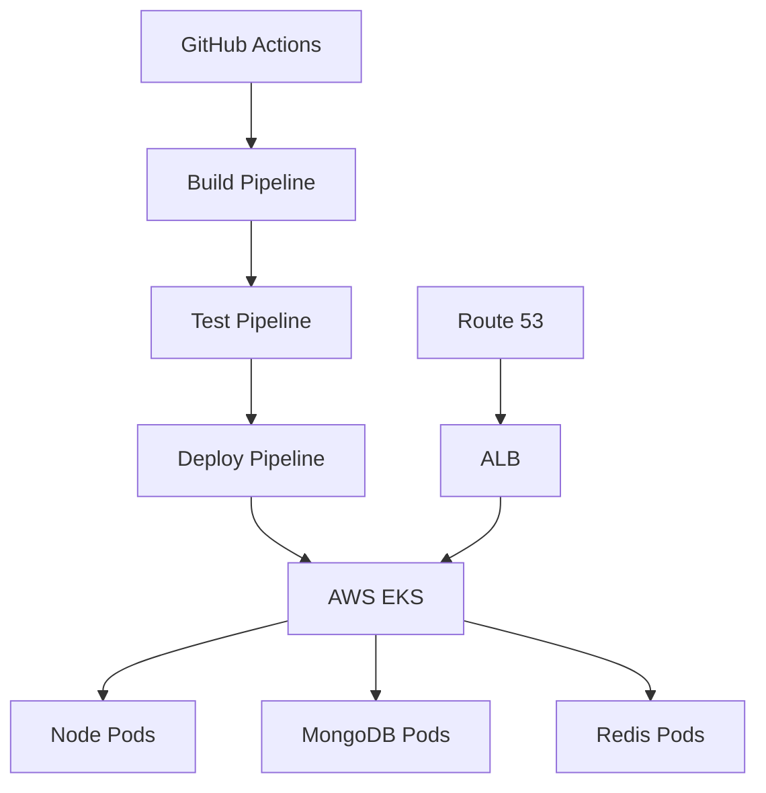

# 5. SYSTEM DESIGN

## 5.1 User Interface Design

### 5.1.1 Layout Structure

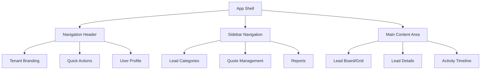

### 5.1.2 Lead Management Interface

| Component | Description | Features |
|-----------|-------------|-----------|
| Category Bar | Visual category filters | - Icon-based category buttons<br>- Count indicators<br>- Active state highlighting |
| Lead Board | Kanban-style board | - Drag-drop lead cards<br>- Status columns<br>- Quick actions |
| Lead Card | Individual lead display | - Status indicator<br>- Priority level<br>- Assignment info<br>- Action buttons |

### 5.1.3 Category Visualization

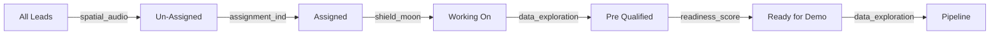

## 5.2 Database Design

### 5.2.1 Schema Structure

```mermaid
erDiagram
    TENANT ||--o{ LEAD : contains
    TENANT ||--o{ USER : employs
    USER ||--o{ LEAD : manages
    LEAD ||--o{ ACTIVITY : tracks
    LEAD ||--o{ QUOTE : generates
    
    TENANT {
        uuid id PK
        string name
        jsonb settings
        timestamp created_at
    }
    
    LEAD {
        uuid id PK
        uuid tenant_id FK
        string category
        uuid assigned_to FK
        string status
        jsonb metadata
    }
    
    USER {
        uuid id PK
        uuid tenant_id FK
        string email
        string role
        jsonb preferences
    }
    
    ACTIVITY {
        uuid id PK
        uuid lead_id FK
        string type
        timestamp created_at
        jsonb details
    }
```

### 5.2.2 Multi-tenant Data Isolation

| Layer | Implementation | Purpose |
|-------|---------------|----------|
| Collection Level | Tenant-specific collections | Physical data separation |
| Query Level | Tenant context middleware | Automatic filtering |
| Index Level | Compound indexes with tenant_id | Query optimization |
| Backup Level | Tenant-aware backup jobs | Isolated recovery |

## 5.3 API Design

### 5.3.1 RESTful Endpoints

```mermaid
sequenceDiagram
    participant Client
    participant Gateway
    participant Auth
    participant LeadService
    participant Database
    
    Client->>Gateway: Request /api/leads
    Gateway->>Auth: Validate JWT
    Auth->>Gateway: Token Valid
    Gateway->>LeadService: Get Leads (tenant context)
    LeadService->>Database: Query (with tenant filter)
    Database->>LeadService: Lead Data
    LeadService->>Gateway: Formatted Response
    Gateway->>Client: JSON Response
```

### 5.3.2 API Structure

| Endpoint | Method | Purpose | Request Body | Response |
|----------|--------|---------|--------------|-----------|
| /api/leads | GET | List leads | Query params | Lead[] |
| /api/leads | POST | Create lead | Lead object | Lead |
| /api/leads/:id | PUT | Update lead | Lead object | Lead |
| /api/leads/:id/category | PATCH | Update category | Category | Lead |
| /api/quotes | POST | Create quote | Quote object | Quote |

### 5.3.3 Real-time Updates

```mermaid
sequenceDiagram
    participant Client
    participant WebSocket
    participant LeadService
    participant EventBus
    
    Client->>WebSocket: Connect (JWT)
    WebSocket->>Client: Connected
    
    LeadService->>EventBus: Lead Updated
    EventBus->>WebSocket: Broadcast Update
    WebSocket->>Client: Lead Update Event
```

### 5.3.4 Data Flow Architecture

```mermaid
flowchart TD
    A[Client Application] -->|HTTPS| B[API Gateway]
    B -->|Auth| C[Auth Service]
    B -->|Leads| D[Lead Service]
    B -->|Quotes| E[Quote Service]
    
    D -->|Read/Write| F[(Primary DB)]
    E -->|Read/Write| F
    
    D -->|Cache| G[(Redis)]
    E -->|Cache| G
    
    H[WebSocket Server] -->|Events| I[Event Bus]
    I -->|Notify| A
```

# 6. USER INTERFACE DESIGN

## 6.1 Layout Components

### 6.1.1 Main Navigation Structure
```
+----------------------------------------------------------+
|  [#] LOGO    [@]Profile  [!]Notifications  [=]Settings    |
+----------------------------------------------------------+
|  +----------------+  +--------------------------------+    |
|  | CATEGORIES     |  | LEAD BOARD                     |    |
|  |                |  |                                |    |
|  | [*] All Leads  |  | +----------+ +------------+    |    |
|  | [?] Unassigned |  | |UNASSIGNED| |IN PROGRESS |    |    |
|  | [@] Assigned   |  | |          | |            |    |    |
|  | [!] New Data   |  | | Lead 1   | | Lead 3     |    |    |
|  | [i] Working    |  | | Lead 2   | | Lead 4     |    |    |
|  | [$] Pipeline   |  | |          | |            |    |    |
|  |                |  | |[+]Add    | |[+]Add      |    |    |
|  +----------------+  | +----------+ +------------+    |    |
|                     +--------------------------------+    |
+----------------------------------------------------------+
```

### 6.1.2 Lead Detail View
```
+----------------------------------------------------------+
| [<]Back   Lead Details: LEAD-001              [=]Actions  |
+----------------------------------------------------------+
| Status: [v]Working On                                     |
|                                                          |
| +------------------+  +------------------------------+    |
| | LEAD INFO        |  | ACTIVITY TIMELINE            |    |
| |                  |  |                              |    |
| | Name: [...]      |  | [i]Created - 2023-10-01     |    |
| | Email:[...]      |  | [@]Assigned to John         |    |
| | Phone:[...]      |  | [$]Quote Generated          |    |
| |                  |  | [!]Demo Scheduled           |    |
| | Category:[v]     |  |                              |    |
| | Priority:[v]     |  | [+]Add Activity             |    |
| +------------------+  +------------------------------+    |
|                                                          |
| [Save] [Generate Quote] [Schedule Demo]                  |
+----------------------------------------------------------+
```

### 6.1.3 Quote Generation Interface
```
+----------------------------------------------------------+
| [<]Back   New Quote: LEAD-001                    [$]      |
+----------------------------------------------------------+
| Customer Information:                                      |
| +--------------------------------------------------+     |
| | Company: [....................]                   |     |
| | Contact: [....................]                   |     |
| +--------------------------------------------------+     |
|                                                          |
| Quote Items:                                             |
| +--------------------------------------------------+     |
| | Item         Quantity    Price      Total         |     |
| | [v]          [...]      [...]      [Auto]        |     |
| | [v]          [...]      [...]      [Auto]        |     |
| | [+]Add Item                                      |     |
| +--------------------------------------------------+     |
|                                                          |
| Subtotal:   $0.00                                       |
| Tax:        $0.00                                       |
| Total:      $0.00                                       |
|                                                          |
| [Preview Quote] [Save Draft] [Send to Customer]          |
+----------------------------------------------------------+
```

## 6.2 Component Legend

### Navigation Elements
- [#] - Main menu/dashboard icon
- [@] - User profile/account
- [!] - Notifications/alerts
- [=] - Settings/options menu
- [<] - Back navigation
- [>] - Forward/next action

### Status Indicators
- [*] - Important/starred items
- [i] - Information indicator
- [?] - Help/support
- [$] - Financial/quote related
- [!] - Warning/attention needed

### Interactive Elements
- [...] - Text input field
- [v] - Dropdown menu
- [ ] - Checkbox
- ( ) - Radio button
- [Button] - Clickable button
- [+] - Add new item

## 6.3 Responsive Breakpoints

| Breakpoint | Width | Layout Adjustments |
|------------|-------|-------------------|
| Mobile | <768px | Single column, collapsed sidebar |
| Tablet | 768-1024px | Two column, collapsible sidebar |
| Desktop | >1024px | Full three column layout |

## 6.4 Theme Specifications

| Element | Light Theme | Dark Theme |
|---------|------------|------------|
| Background | #FFFFFF | #121212 |
| Primary Text | #333333 | #FFFFFF |
| Secondary Text | #666666 | #B0B0B0 |
| Borders | #E0E0E0 | #424242 |
| Primary Action | #1976D2 | #90CAF9 |
| Secondary Action | #388E3C | #81C784 |
| Warning | #FFA000 | #FFB74D |
| Error | #D32F2F | #EF5350 |

## 6.5 Interaction States

| Element | State | Visual Indicator |
|---------|-------|-----------------|
| Buttons | Hover | Brightness +10% |
| Buttons | Active | Brightness -10% |
| Buttons | Disabled | Opacity 50% |
| Links | Hover | Underline |
| Links | Visited | Color change |
| Inputs | Focus | Border highlight |
| Inputs | Error | Red border + icon |
| Inputs | Success | Green border + icon |

# 7. SECURITY CONSIDERATIONS

## 7.1 Authentication and Authorization

### 7.1.1 Authentication Flow

```mermaid
sequenceDiagram
    participant User
    participant Client
    participant Gateway
    participant Auth
    participant TokenService
    participant UserDB
    
    User->>Client: Login Request
    Client->>Gateway: POST /auth/login
    Gateway->>Auth: Validate Credentials
    Auth->>UserDB: Query User + Tenant
    UserDB->>Auth: User Data
    Auth->>TokenService: Generate Tokens
    TokenService->>Auth: JWT Tokens
    Auth->>Client: Access + Refresh Tokens
    Client->>User: Login Success
```

### 7.1.2 Authorization Matrix

| Role | Lead Management | Quote Management | User Management | System Config | Reports |
|------|----------------|------------------|-----------------|---------------|----------|
| Admin | Full Access | Full Access | Full Access | Full Access | Full Access |
| Manager | Full Access | Full Access | View Only | No Access | Full Access |
| Agent | Assigned Only | Create/Edit | No Access | No Access | Own Data |
| Viewer | View Only | View Only | No Access | No Access | Limited |

### 7.1.3 Token Management

| Token Type | Duration | Refresh Policy | Storage |
|------------|----------|----------------|----------|
| Access Token | 15 minutes | Required | Memory only |
| Refresh Token | 7 days | One-time use | HTTP-only cookie |
| API Token | 30 days | Auto-renewal | Secure storage |

## 7.2 Data Security

### 7.2.1 Encryption Standards

```mermaid
flowchart TD
    A[Data Entry] -->|TLS 1.3| B[API Gateway]
    B -->|Field Encryption| C[Application Layer]
    C -->|AES-256| D[Database Layer]
    D -->|Encrypted at Rest| E[(Storage)]
    
    F[Key Management] -->|Rotation| G[Key Vault]
    G -->|Access Keys| B
    G -->|Encryption Keys| C
    G -->|Storage Keys| D
```

### 7.2.2 Data Protection Measures

| Layer | Protection Method | Implementation |
|-------|------------------|----------------|
| Transport | TLS 1.3 | Strict SSL/TLS configuration |
| Application | Field-level encryption | AES-256-GCM |
| Database | Transparent encryption | MongoDB Enterprise Encryption |
| Backup | Encrypted backups | AWS KMS integration |
| File Storage | Server-side encryption | S3 encryption with CMK |

### 7.2.3 Tenant Isolation

```mermaid
flowchart LR
    A[Request] -->|JWT Validation| B{Tenant Context}
    B -->|Tenant A| C[(Tenant A DB)]
    B -->|Tenant B| D[(Tenant B DB)]
    B -->|Tenant C| E[(Tenant C DB)]
    
    F[Schema Validation] --> C
    F --> D
    F --> E
```

## 7.3 Security Protocols

### 7.3.1 Access Control Policies

| Control Type | Implementation | Monitoring |
|--------------|----------------|------------|
| IP Filtering | AWS WAF rules | Real-time alerts |
| Rate Limiting | Redis-based throttling | Usage metrics |
| Session Management | Redis session store | Activity logs |
| API Security | OAuth 2.0 + CORS | Request logging |

### 7.3.2 Security Monitoring

```mermaid
flowchart TD
    A[Security Events] -->|Collection| B[Log Aggregator]
    B -->|Analysis| C[SIEM]
    C -->|Detection| D[Alert System]
    
    E[Metrics] -->|Monitoring| F[Security Dashboard]
    F -->|Threshold Alerts| D
    D -->|Notification| G[Security Team]
    
    H[Vulnerability Scanner] -->|Findings| I[Security Reports]
    I -->|Critical Issues| D
```

### 7.3.3 Compliance Requirements

| Requirement | Implementation | Validation |
|-------------|----------------|------------|
| GDPR | Data encryption, access controls | Annual audit |
| SOC 2 | Security monitoring, incident response | Quarterly review |
| ISO 27001 | Security management system | External audit |
| PCI DSS | Cardholder data protection | Monthly scan |

### 7.3.4 Security Response Plan

| Incident Type | Response Time | Action Plan |
|--------------|---------------|-------------|
| Data Breach | 15 minutes | Isolation, investigation, notification |
| Authentication Attack | 5 minutes | Block source, reset affected accounts |
| API Abuse | 10 minutes | Rate limit adjustment, blacklist |
| Malware Detection | 30 minutes | System scan, removal, impact analysis |

# 8. INFRASTRUCTURE

## 8.1 DEPLOYMENT ENVIRONMENT

The system utilizes a cloud-native architecture deployed primarily on AWS infrastructure with the following environment structure:

| Environment | Purpose | Infrastructure |
|------------|---------|----------------|
| Development | Local development and testing | Docker containers on developer machines |
| Staging | Pre-production validation | AWS EKS cluster (smaller scale) |
| Production | Live system | Multi-region AWS EKS deployment |
| DR | Disaster recovery | Secondary region AWS infrastructure |

```mermaid
flowchart TD
    A[Production Traffic] -->|Route 53| B{Global Load Balancer}
    B -->|Primary| C[Region: US-East-1]
    B -->|Failover| D[Region: US-West-2]
    
    C -->|ALB| E[EKS Cluster East]
    D -->|ALB| F[EKS Cluster West]
    
    E -->|Node Groups| G[Application Pods]
    F -->|Node Groups| H[Application Pods]
    
    G -->|Read/Write| I[(MongoDB Atlas)]
    H -->|Read/Write| I
```

## 8.2 CLOUD SERVICES

| Service | Purpose | Justification |
|---------|---------|---------------|
| AWS EKS | Container orchestration | Managed Kubernetes with high availability |
| AWS RDS | Database backups | Automated backup management |
| AWS S3 | File storage | Scalable object storage for documents |
| AWS CloudFront | CDN | Global content delivery |
| AWS Route 53 | DNS management | Global DNS with health checking |
| AWS ACM | SSL certificates | Managed SSL certificate lifecycle |
| MongoDB Atlas | Database service | Multi-region database cluster |
| Redis Enterprise | Caching layer | Managed Redis with high availability |

## 8.3 CONTAINERIZATION

```mermaid
graph TD
    A[Base Image] -->|Node 18 Alpine| B[Backend Services]
    A -->|Node 18 Alpine| C[Frontend Build]
    
    B -->|Dockerfile| D[API Container]
    B -->|Dockerfile| E[Worker Container]
    C -->|Dockerfile| F[Nginx Container]
    
    D -->|Push| G[ECR Repository]
    E -->|Push| G
    F -->|Push| G
    
    G -->|Pull| H[EKS Cluster]
```

### Container Specifications

| Service | Base Image | Resources |
|---------|------------|-----------|
| API Services | node:18-alpine | 2 CPU, 4GB RAM |
| Frontend | nginx:alpine | 1 CPU, 2GB RAM |
| Workers | node:18-alpine | 2 CPU, 4GB RAM |
| Redis | redis:7-alpine | 2 CPU, 4GB RAM |

## 8.4 ORCHESTRATION

```mermaid
graph TD
    A[EKS Control Plane] -->|Manages| B[Node Group 1]
    A -->|Manages| C[Node Group 2]
    A -->|Manages| D[Node Group 3]
    
    B -->|Runs| E[API Pods]
    C -->|Runs| F[Frontend Pods]
    D -->|Runs| G[Worker Pods]
    
    H[AWS ALB] -->|Routes| E
    H -->|Routes| F
    
    I[Cluster Autoscaler] -->|Scales| B
    I -->|Scales| C
    I -->|Scales| D
```

### Kubernetes Resources

| Resource Type | Configuration | Purpose |
|--------------|---------------|----------|
| Deployments | Rolling updates | Application deployment management |
| HPA | CPU/Memory based | Automatic pod scaling |
| Services | LoadBalancer/ClusterIP | Internal/external access |
| ConfigMaps | Environment specific | Configuration management |
| Secrets | AWS KMS encrypted | Sensitive data management |

## 8.5 CI/CD PIPELINE

```mermaid
flowchart LR
    A[GitHub] -->|Trigger| B[GitHub Actions]
    B -->|Build| C[Test Stage]
    C -->|Success| D[Build Stage]
    D -->|Push| E[ECR]
    
    D -->|Deploy| F[Dev Environment]
    F -->|Promote| G[Staging Environment]
    G -->|Approve| H[Production Environment]
    
    I[ArgoCD] -->|Sync| F
    I -->|Sync| G
    I -->|Sync| H
```

### Pipeline Stages

| Stage | Actions | Tools |
|-------|---------|-------|
| Build | Code compilation, dependency installation | npm, webpack |
| Test | Unit tests, integration tests, linting | Jest, ESLint |
| Security | Dependency scanning, SAST | Snyk, SonarQube |
| Package | Container image building | Docker, BuildKit |
| Deploy | Infrastructure updates, application deployment | ArgoCD, Helm |
| Verify | Health checks, smoke tests | K8s probes |

### Deployment Strategy

| Environment | Strategy | Automation |
|-------------|----------|------------|
| Development | Direct deployment | Automatic on merge |
| Staging | Blue/Green deployment | Automatic with tests |
| Production | Canary deployment | Manual approval |

# 8. APPENDICES

## 8.1 ADDITIONAL TECHNICAL INFORMATION

### 8.1.1 Lead Category Implementation Details

| Category | Icon | Technical Implementation |
|----------|------|-------------------------|
| All Leads | spatial_audio | Global view with aggregated metrics |
| Un-Assigned | assignment_ind | Queue-based distribution system |
| Assigned | shield_moon | Agent workload balancing |
| New Data | headset_mic | Real-time data ingestion pipeline |
| Working On | data_exploration | Activity tracking system |
| Pre Qualified | data_exploration | Scoring algorithm integration |
| Repeating Customer | data_exploration | Customer history analysis |
| One Time Customer | face_5 | Transaction pattern detection |
| Not Interested/DND | shield_moon | Automated blacklist management |
| Report to Lead Gen | blanket | Analytics feedback loop |
| Ready for Demo | readiness_score | Scheduling system integration |
| Pipeline | data_exploration | Revenue forecasting engine |

### 8.1.2 Multi-tenant Data Architecture

```mermaid
flowchart TD
    A[Tenant Request] -->|JWT Validation| B{Tenant Router}
    B -->|Tenant A| C[(Tenant A Database)]
    B -->|Tenant B| D[(Tenant B Database)]
    B -->|Tenant N| E[(Tenant N Database)]
    
    F[Shared Services] -->|Tenant Context| G[Authentication]
    F -->|Tenant Context| H[File Storage]
    F -->|Tenant Context| I[Email Service]
    
    J[Background Jobs] -->|Tenant Specific| K[Job Queue]
    K -->|Process| L[Tenant Operations]
```

## 8.2 GLOSSARY

| Term | Definition |
|------|------------|
| Activity Timeline | Chronological record of all interactions with a lead |
| Agent Capacity | Maximum number of leads an agent can handle effectively |
| Conversion Rate | Percentage of leads that become customers |
| Lead Scoring | Numerical value assigned to leads based on qualification criteria |
| Pipeline Value | Total potential revenue from all leads in the pipeline |
| Qualification Criteria | Set of standards used to evaluate lead quality |
| Quote Version | Iteration of a price proposal for a lead |
| Tenant Isolation | Separation of data and resources between different organizations |
| Workflow Rules | Automated processes that trigger based on lead status changes |
| Lead Source | Origin point of lead generation |

## 8.3 ACRONYMS

| Acronym | Full Form |
|---------|-----------|
| ALB | Application Load Balancer |
| CORS | Cross-Origin Resource Sharing |
| CRUD | Create, Read, Update, Delete |
| DND | Do Not Disturb |
| ELK | Elasticsearch, Logstash, Kibana |
| GDPR | General Data Protection Regulation |
| MFA | Multi-Factor Authentication |
| RBAC | Role-Based Access Control |
| SaaS | Software as a Service |
| SDK | Software Development Kit |
| SPA | Single Page Application |
| SSO | Single Sign-On |
| TLS | Transport Layer Security |
| WAF | Web Application Firewall |
| XSS | Cross-Site Scripting |

```mermaid
graph TD
    A[Technical Terms] --> B[Development]
    A --> C[Security]
    A --> D[Infrastructure]
    
    B --> E[SPA/SDK/CRUD]
    C --> F[MFA/SSO/RBAC]
    D --> G[ALB/WAF/TLS]
```